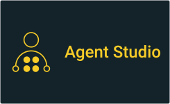

> IMPORTANT: Please read the following before proceeding. This AMP includes or otherwise depends on certain third party software packages. Information about such third party software packages are made available in the notice file associated with this AMP. By configuring and launching this AMP, you will cause such third party software packages to be downloaded and installed into your environment, in some instances, from third parties' websites. For each third party software package, please see the notice file and the applicable websites for more information, including the applicable license terms.

> If you do not wish to download and install the third party software packages, do not configure, launch or otherwise use this AMP. By configuring, launching or otherwise using the AMP, you acknowledge the foregoing statement and agree that Cloudera is not responsible or liable in any way for the third party software packages.

> Copyright (c) 2025 - Cloudera, Inc. All rights reserved.

# Cloudera AI Agent Studio

Cloudera AI's Agent Studio is a platform for building, testing, and deploying AI agents and workflows. It provides an intuitive interface for creating custom AI agents and tools, and combining them into automated workflows.
- Agent Studio ships with a set of pre-built tools and workflows (called "templates"). Use these to get started quickly.
- Users can create custom agents, tools and workflows. Test the workflows in the Studio. Save them as templates for reuse.
- Workflows can be deployed as long-running endpoints ready for production use.

## Getting Started

### User Guides
 - Workflows in Agent Studio. ([Workflows User Guide](./docs/user_guide/workflows.md))
 - Configuring LLMs for agents to use. ([LLMs User Guide](./docs/user_guide/models.md))
 - Creating new tools or using existing tool templates. ([Tools User Guide](./docs/user_guide/tools.md))
 - Configure MCP servers for use by agents. [Model Context Protocol](https://modelcontextprotocol.io/introduction) servers to use with agents. ([MCP User Guide](./docs/user_guide/mcp.md))
 - Learn about using the example prepackaged workflow templates ([Workflow Templates Guide](docs/user_guide/workflow_templates.md))
 - Understanding workflow deployments in Agent Studio. ([Deployments User Guide](./docs/user_guide/deployments.md))
 - Monitoring workflows. ([Monitoring User Guide](./docs/user_guide/monitoring.md))
 - Building custom UIs on top of deployed workflows. ([Custom Applications Guide](./docs/user_guide/custom_workflow_application.md))
 - Building custom workflows outside of Agent Studio, and deploying to Agent Studio. ([Custom Workflows Guide](./docs/user_guide/custom_workflows.md))

### For Agent Studio Admins
These docs are targeted for individuals managing the Agent Studio instance itself within a project.
 - *to come*

### For Agent Studio Tool Developers
These docs are targeted for individuals who are building custom Agent Studio tools.
 - [Creating Custom Tools](./docs/user_guide/custom_tools.md)

### For [Model Context Protocol(MCP)](https://modelcontextprotocol.io/introduction) Users
These docs are targetted towards individuals looking to connect MCP servers to agents in workflows.
 - [MCP User Guide](./docs/user_guide/mcp.md)
 - [Barebones example of using a MCP Server in Agent Studio](./docs/user_guide/mcp_example.md)
